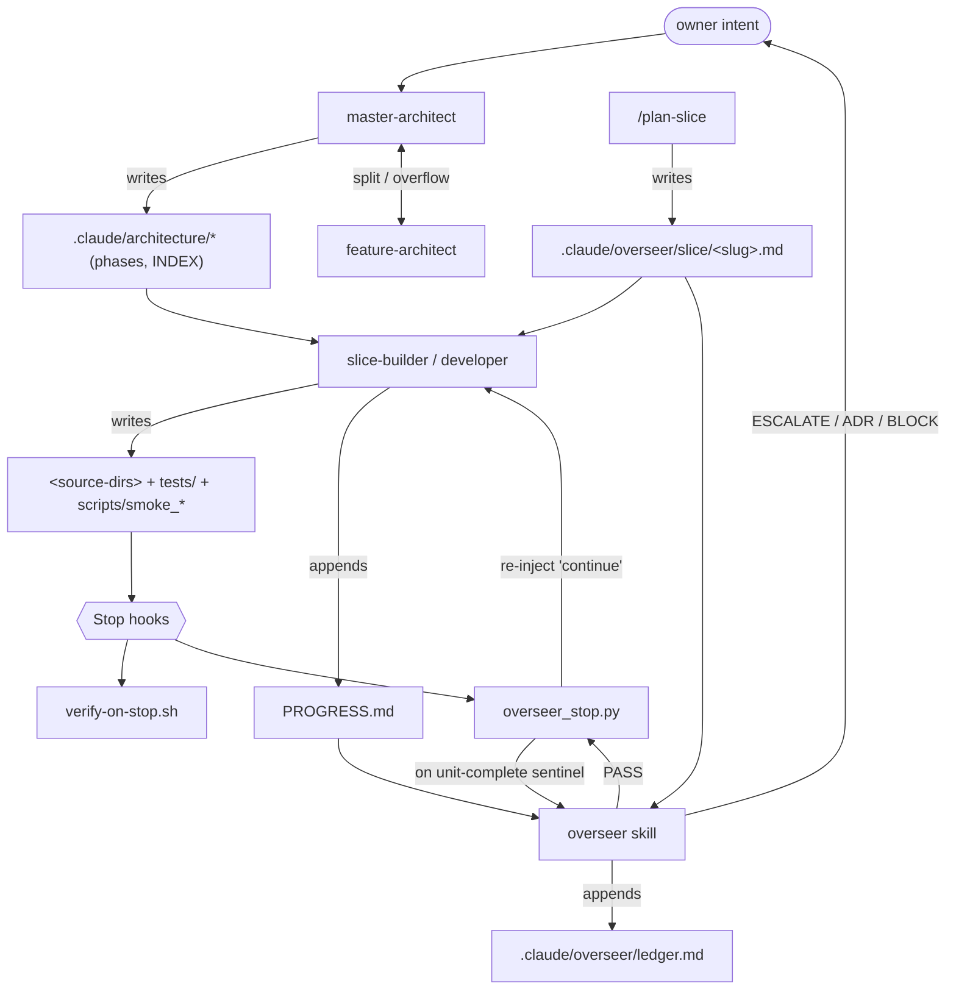
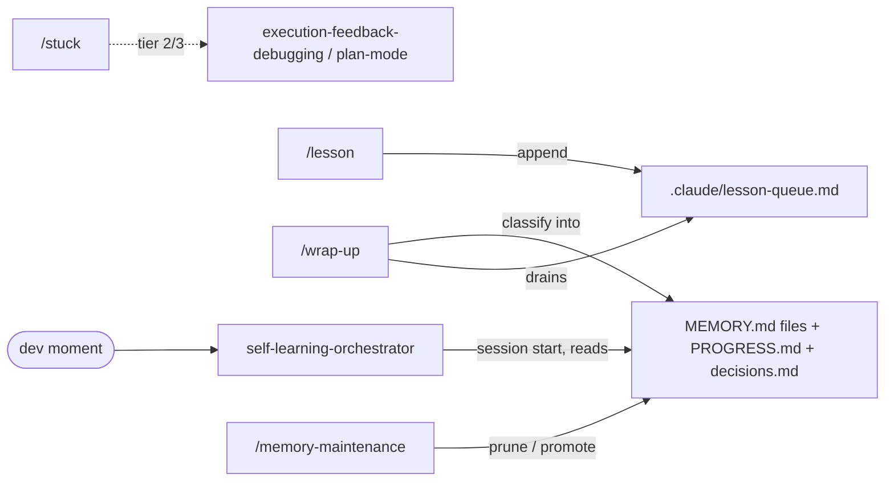

# Agentic system — map & integration guide

This is the **map** of the agentic system that operates on this repo: which
agent produces which artifact, who consumes it, and who hands off to whom.
Read it before adding a new agent — it shows where a new part fits and what
communication contract it must honour.

This file **maps**; it is not the source of truth for any agent's behaviour.
Each agent's behaviour lives in its own definition (see
[§7 Where definitions live](#7-where-the-definitions-live)). When this map and
a definition disagree, the definition wins — and this map is stale and should
be fixed.

**Tag legend:** `[project]` = repo-native, defined only in this repo's
`.claude/`. `[vendored]` = a skill **copied** into `.claude/skills/` from
`~/.claude/skills/` so the repo is self-contained — it is a **fork**; upstream
changes are not picked up automatically (see §8). `[global]` = still defined
only in `~/.claude/` (the subagents and some commands were not vendored).

---

## 1. The 30-second model

Agents communicate through **files (artifacts), never through chat**. There are
four cooperating layers:

| Layer | What it does | Lives in |
|---|---|---|
| **Design** | Turns intent into a task/slice plan | `.claude/architecture/`, `.claude/overseer/slice/` |
| **Build** | Writes code + tests under TDD | source dirs, `tests/`, `scripts/` |
| **Enforce** | Hooks + overseer keep discipline | `.claude/hooks/`, `.claude/overseer/` |
| **Remember** | Distils lessons across sessions | `PROGRESS.md`, memory files, `.claude/lesson-queue.md` |

One build pipeline is active:

**Slice flow.** `master-architect` (design) → `slice-builder` / the developer
agent (build) → `overseer` (audit). Plans live in
`.claude/overseer/slice/<slug>.md`; history in `PROGRESS.md`.

---

## 2. Component catalog

| Component | Tag | Kind | One-line role |
|---|---|---|---|
| `master-architect` | `[vendored]` | skill | 5-phase design → architecture handoff |
| `feature-architect` | `[vendored]` | skill | Splits an oversized task into a DAG of sub-tasks |
| `slice-builder` | `[vendored]` | skill | Builds one thin vertical slice (seam-first TDD) |
| `self-learning-orchestrator` | `[vendored]` | skill | Dispatches the memory lifecycle at each dev moment |
| `documentation` | `[vendored]` | skill | Maintains AGENTS.md / ADRs / `docs/` (this guide's skill) |
| `claude-autonomy` | `[vendored]` | skill | One-time config of `settings.json` + the 6 hooks |
| `overseer` | `[project]` | skill | 12-check discipline audit of the last turn |
| `plan-slice` | `[project]` | command | Writes a slice contract before implementation |
| `/lesson` `/wrap-up` `/stuck` `/memory-maintenance` | `[global]` | commands | Memory-lifecycle entry points |
| 6 hooks | `[project]` | hooks | Enforcement (see [§4](#4-the-enforcement-layer-hooks)) |

---

## 3. Artifact catalog — who writes, who reads

Paths are **this repo's** locations. The `lifetime` column tells a builder how
volatile the artifact is.

| Artifact (this repo) | Producer(s) | Consumer(s) | Lifetime |
|---|---|---|---|
| `.claude/architecture/INDEX.md` | `master-architect` | architect, humans | per phase |
| `.claude/architecture/phase-0-brief.md`, `phase-1-system.md` | `master-architect` | `slice-builder` (context) | append/superseded |
| `.claude/architecture/phase-2..4*` | `master-architect`, `feature-architect` | `slice-builder` | created per phase |
| `.claude/architecture/PROGRESS.md` | `master-architect` | architect (resume) | per session |
| `.claude/overseer/slice/<slug>.md` | `plan-slice`, developer | `overseer` (load-bearing), developer | per slice |
| `.claude/overseer/ledger.md` | `overseer` | `overseer` (counts PASS streak) | append-only |
| `.claude/overseer/MEMORY.md` | `overseer` | `overseer` | cross-slice, cited-or-pruned |
| `.claude/overseer/audit.md` | `overseer` | humans (ratify V2 checks) | append-only |
| `.claude/overseer/escalations.md` | humans | `overseer` | append-only |
| `.claude/overseer/state` | (manual / planning) | `overseer_stop.py` (phase guard) | ephemeral |
| `.claude/overseer/.last_audit_sha`, `.last_continue_sha` | `overseer_stop.py` | `overseer_stop.py` (recursion guard) | ephemeral |
| `.claude/artifacts/spikes/*` | developer, smoke/probe scripts | `PROGRESS.md`, ADRs | dated, kept |
| `.claude/artifacts/notes-during-session.md` | developer | developer | scratch |
| `PROGRESS.md` (root) | `slice-builder`, developer | `overseer`, `self-learning-orchestrator`, humans | append-only |
| `CLAUDE.md` (root) | `claude-autonomy`, `documentation`, `self-learning-orchestrator` (rare, confirmed) | **every agent** (always loaded) | rare |
| `AGENTS.md` (root) | `documentation` | every agent (via `@AGENTS.md`) | with code changes |
| `docs/adr/NNNN-*.md` | `documentation`, `master-architect`, developer | every agent, humans | **append-only / supersede** |
| `.claude/settings.json` + 6 hooks | `claude-autonomy` | Claude Code harness (session start) | rare |
| `.claude/lesson-queue.md` | `/lesson`, developer | `/wrap-up` (session-end) | drained per session |
| `~/.claude/memory/<tech>/MEMORY.md` `[global]` | `self-learning-orchestrator` | all (session start) | per session-end |
| `decisions.md`, `claude-progress.md`, `<task>/reflections.md` | `self-learning-orchestrator` | same | created on demand |

---

## 4. The enforcement layer (hooks)

All 6 are `[project]`, produced by `claude-autonomy`, wired in
`.claude/settings.json`. They are the harness-executed guardrails every agent
runs inside.

| Hook | Event | Gates / effect | Artifacts touched |
|---|---|---|---|
| `block-dangerous.sh` | PreToolUse `Bash` | Blocks destructive patterns **and `git commit`** | — |
| `protect-paths.sh` | PreToolUse `Edit/Write/MultiEdit` | Blocks `.env`, `secrets/`, `migrations/`, `.git/`, workflows | — |
| `format-on-edit.sh` | PostToolUse `Edit/Write/MultiEdit` | `ruff format` + import-sort on `.py` | edited `.py` |
| `verify-on-stop.sh` | Stop | `ruff` + `mypy` + `pytest` on changed Python; blocks turn on fail | — |
| `overseer_stop.py` | Stop | Triggers the overseer audit on a unit-completion claim | reads/writes `.claude/overseer/{state,.last_*_sha}` |
| `auto-approve-web.py` | PreToolUse / PermissionRequest `WebFetch/WebSearch` | Auto-approves read-only web access | — |

`verify-on-stop.sh` enforces lint + type-check + tests on every turn where
Python files changed. See [§5](#5-cooperation--dataflow) for the full flow.

---

## 5. Cooperation & dataflow

### Slice flow

### Memory lifecycle (cross-cutting)

---

## 6. How to add a new agent

A new agent integrates by honouring the **artifact contract** above — not by
calling other agents directly. Checklist:

1. **Pick the layer** (design / build / enforce / remember). State it in the
   agent's own doc.
2. **Declare its artifacts.** List what it **produces** and **consumes** using
   the paths in [§3](#3-artifact-catalog--who-writes-who-reads). Reuse an
   existing artifact where possible; introduce a new one only if no existing
   contract fits. Prefer files under `.claude/` for this repo.
3. **Wire triggers & handoffs.** Decide what invokes it (user phrase, a hook,
   or another agent's handoff) and who it hands off to. If it joins the slice
   loop, it must respond to the overseer's `OVERSEER_PASS` → continue cycle and
   emit a halt marker (`OVERSEER_SLICE_AWAITING_OWNER:` etc.) when done.
4. **Respect the gates.** Anything that edits code passes
   `verify-on-stop.sh` (lint + type-check + tests) at turn end.
5. **Never commit.** `git commit` is hook-blocked; agents stage and report, the
   human commits.
6. **Register it.** A skill → `~/.claude/skills/<name>/SKILL.md` (or
   `.claude/skills/` if repo-local); a subagent → `~/.claude/agents/<name>.md`;
   a command → `.claude/commands/<name>.md`; a hook → `.claude/hooks/` **plus**
   an entry in `.claude/settings.json`.
7. **Update this map.** Add the component to [§2](#2-component-catalog) and its
   artifacts to [§3](#3-artifact-catalog--who-writes-who-reads). The change is
   not done until this guide reflects it.

---

## 7. Where the definitions live

This map points; it does not restate. For behaviour, read the source:

- Skills: all under `.claude/skills/<name>/SKILL.md` — `overseer` is
  repo-native; the other 5 are **vendored** copies (keep them in sync manually — see §8).
- Subagents (critic agents): `.claude/agents/*.md` — repo-native.
- Commands: `.claude/commands/{plan-slice,master-architect,feature-architect}.md`;
  memory-lifecycle commands (`/lesson`, `/wrap-up`, `/stuck`, `/memory-maintenance`)
  are expected in `~/.claude/commands/` (global).
- Hooks: `.claude/hooks/*` (wired in `.claude/settings.json`).
- Standing policy: `CLAUDE.md` + `AGENTS.md` (root).

---

## 8. Vendoring & path conventions

**All paths are under `.claude/`.** Every skill in this repo uses the `.claude/`
prefix for its artifacts: `.claude/architecture/`, `.claude/overseer/`,
`.claude/artifacts/`. There is no root-level `.architecture/` or `artifacts/`
directory. When reading a skill, all paths are taken as written.

**Note for `references/madr-format.md` and `references/c4-mermaid-syntax.md`.**
These describe `master-architect`'s default output location as `.architecture/`
because that skill is designed to be configurable per project. When using it here,
override to `.claude/architecture/`.

**Vendoring (the 5 `[vendored]` skills).** Copied from upstream into `.claude/skills/`
to make this template self-contained. No global `~/.claude/skills/` directory exists
on the machine, so there is no double-discovery issue. Consequences:

- **Fork / drift.** Copies do not track upstream automatically. If an upstream skill
  improves, re-copy it into `.claude/skills/` to pick up the change.
- **Single source.** The `.claude/skills/` copies are the only copies. Any project
  using this template gets exactly what is here.
