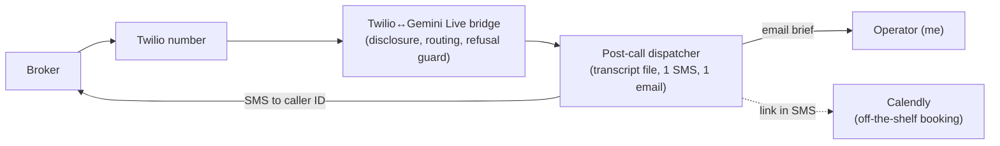

# MVP voice-intake-demo

## Mode and hypothesis

**Mode:** MVP — a real UK mortgage broker calls a real number and has the actual compliant intake conversation, not a mockup of it. The real value delivered is an accurate, unscripted preview of the product they'd be buying, sufficient to base a genuine purchase decision on. The broker isn't adopting the intake service into their business here — that's out of scope — so this is a demand smoke-test running on top of a real product instance, not usage in the Ries operational sense. What's validated is willingness to buy, not willingness to use.

**Hypothesis:** A UK mortgage broker who experiences a compliant voice-intake demo call will want to buy it.

**What counts as an answer:** After the call, the broker gets one SMS containing a Calendly link and a pre-screening form.
- **Confirms:** the broker books a follow-up conversation.
- **Rejects:** across several demo calls, brokers engage with the call (finish it, probe the guardrails) but don't book — meaning the compliance-safe intake itself isn't the thing that sells; something else (price, trust, integration) is the blocker, and that's worth an interview, not more building.

## The slice

Three components:
1. **Twilio ↔ Gemini Live bridge** — one process. Plays a hardcoded, non-generative disclosure line first ("This is an AI, it does not give mortgage advice, this call is recorded") before handing control to the model, so disclosure can't be skipped by model behavior. Routes to new-enquiry / status-enquiry / professional based on the first exchange. A deterministic regex safety net inspects generated text before TTS for £, %, "per month", or lender names and swaps in a canned refusal + booking offer — the compliance rule doesn't rely on the LLM's discretion alone.
2. **Post-call dispatcher** — fires once per call, keyed by Twilio CallSid (prevents the one-call-two-SMS failure mode). Writes transcript + timestamp to one file in a UK-region bucket, sends exactly one SMS to the Twilio-reported caller ID (never a number spoken mid-call) with the Calendly + form links, sends one email brief to a fixed operator address — hardcoded, known in advance, no matching needed.
3. **Calendly** — off-the-shelf, no code. Booking outcome is read from Calendly's own dashboard, not built.

## Manual on purpose

- **Did-it-work grading**: whether the refusal guardrail held, whether disclosure landed naturally, is judged by personally reading/listening to each transcript. No eval harness. Stops being practical past roughly 20-30 calls — early demo volume won't hit that.
- **Hypothesis read-out**: cross-referencing "who called" against "who booked" is a manual glance at the Calendly dashboard next to the call log, not a wired-up webhook.

## Build first

**Riskiest assumption:** the Twilio↔Gemini Live audio bridge answers within ~3 seconds and holds a conversation without any mid-sentence gap over 1.5 seconds. If this doesn't hold under real PSTN conditions (codec conversion, jitter), no amount of correct business logic saves the demo — a broker will hang up on a laggy AI in the first five seconds.

**Evidence status:** untested — no spike run yet. Twilio Media Streams + Gemini Live is a documented, supported pattern (common knowledge that the pieces connect), but real-world latency for *this* call path is unverified.

**Build this first, before any state machine or guardrail logic:** a bare bones bridge — Twilio number in, Gemini Live out, one scripted back-and-forth, nothing else — and log timestamps for time-to-first-response and any gap >1.5s across a few real test calls. If it fails, the fix is architectural (different bridging approach), so it has to be known before the rest is built on top of it.

## Hard to undo

- **UK-region storage for transcripts.** Every call captures a caller's personal data. Migrating already-collected recordings/transcripts out of a UK region later is a compliance problem, not a redeploy — pick the region now.
- **The trust boundary: this service never holds credentials to any real case-management system.** Right now it's trivially true (no such system exists yet), but the "never invents case data" guarantee only holds long-term if that's a designed boundary, not an accident of nothing being wired up yet. Don't bolt on case-system read access later without re-deciding this deliberately.
- **The Twilio number, once given to prospects.** Changing it after brokers have called, saved, or referred it burns whatever trust and word-of-mouth is already spent on it.

## Cut list

- CRM / case-management integration — no real case data is ever touched in this MVP, by design.
- Automated Calendly-webhook → analytics pipeline — read the Calendly dashboard by hand.
- Automated transcript QA / guardrail eval harness — human review of each transcript for now.
- Rate limiting / abuse protection on the Twilio number — not a concern at demo call volumes.
- Multi-language support — English only; UK broker market.
- Any correction/fine-tuning layer on top of Gemini Live's built-in ASR — used as-is.
- Persistent or cached "case status" data of any kind — the system must never be able to invent it, so it's never given anywhere to store it.
- Lead-scoring or CRM automation on the email brief — a human reads each one.
- A/B testing of the question script — one fixed flow for now.
- Retention/deletion tooling beyond "the file exists" — deferred until real client data (not demo calls) is in play.
- Lead capture before the call — no landing page, no pre-call form. The phone number is the only identifier, and it comes from the carrier (Twilio caller ID), not from anything the caller typed. A pre-call form would filter out exactly the people the hypothesis needs to reach.
